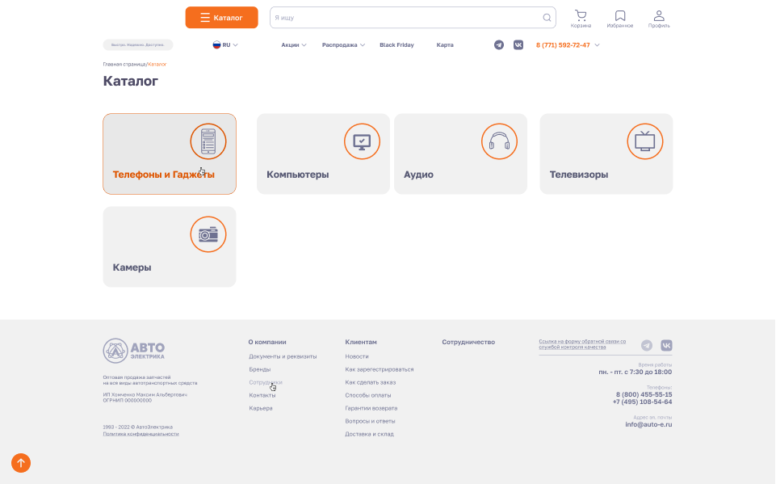

# AITU HackDay 2022

Web platform for electronic goods (KazAeroSpace case)


## Demo

Tech stack used in this project:
- Angular
- MongoDB
- Express
- Puppeteer
- Winston.js (log rotation)
- Docker

%20desktop.png)



## Environment Variables

To run this project, you will need to add the following environment variables to your .env file

`MONGODB_PASSWORD`

`ACCESS_TOKEN_SECRET`

`REFRESH_TOKEN_SECRET`

## Installation

Install backend and frontend separately with npm

```bash
  npm --prefix frontend i
  npm --prefix backend i
  npm --prefix frontend start
  npm --prefix backend start
```

## Deployment

To deploy this project run

```bash
  cd backend && docker build . -t backend
  cd frontend && docker build . -t frontend
  docker run -p 5000:5000 -d backend -e ACCESS_TOKEN_SECRET=YOUR_ACCESS_TOKEN_SECRET -e REFRESH_TOKEN_SECRET=YOUR_REFRESH_TOKEN_SECRET -e MONGODB_PASSWORD=YOUR_MONGODB_PASSWORD
  docker run -p 3000:3000 -d frontend
```

## Contributing

Contributions are always welcome!

See `contributing.md` for ways to get started.

Please adhere to this project's `code of conduct`.